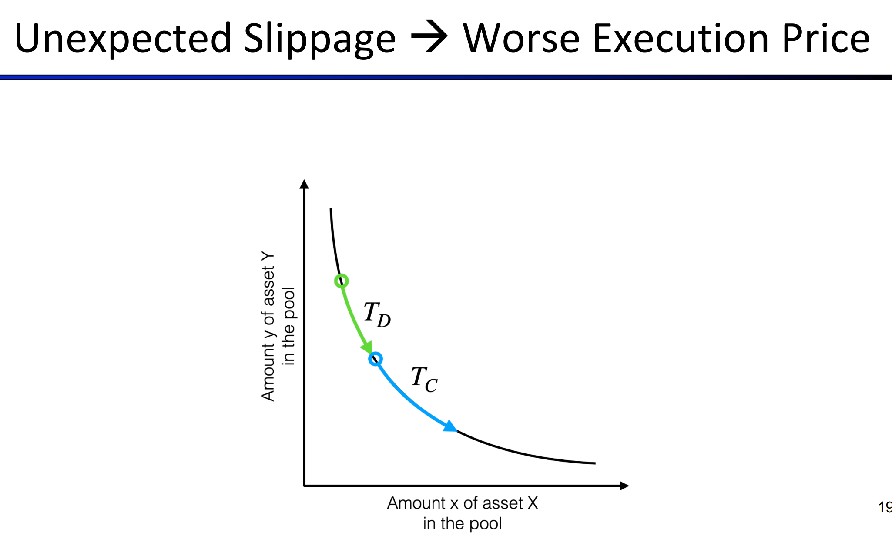
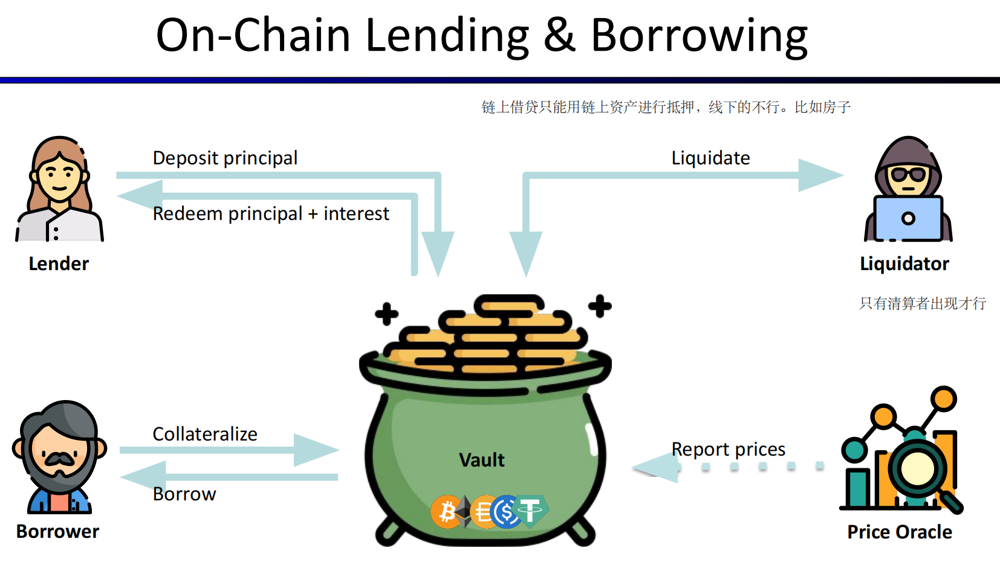
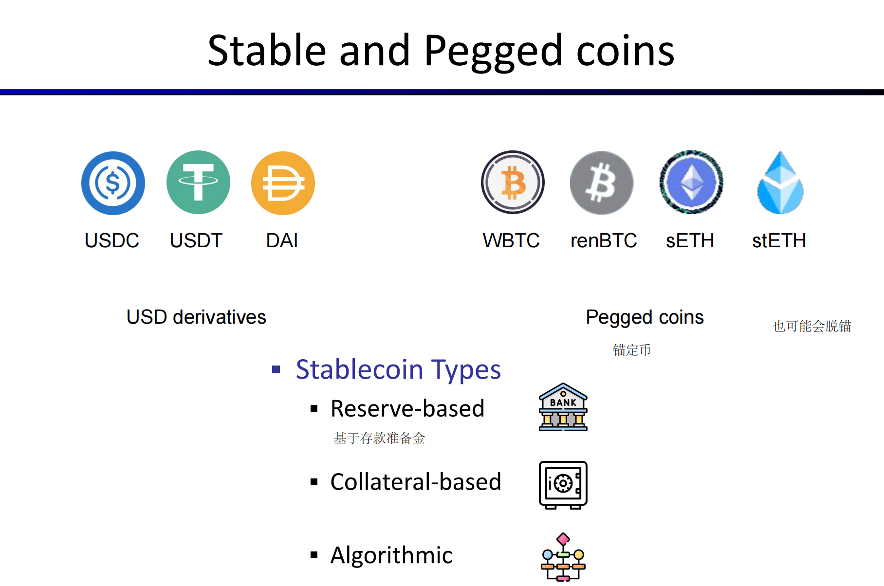
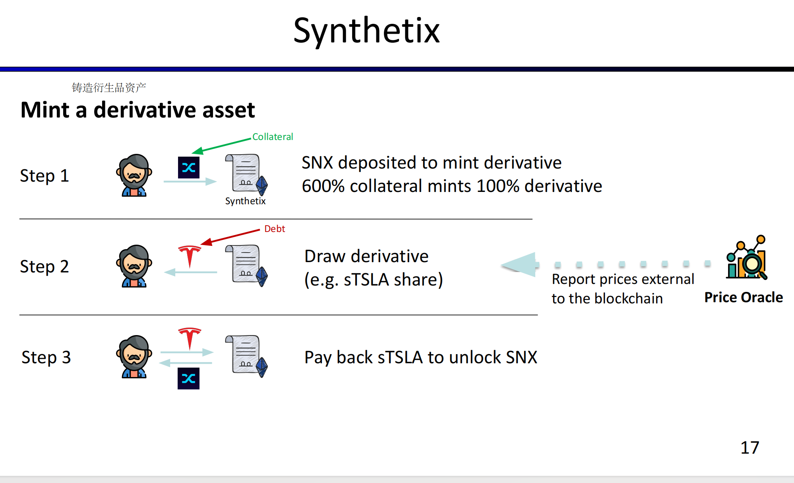

<center>Defi</center>


#### 1. 概述


**区别**

cefi 和 Defi区别


**优势**


**Defi技术栈**


**Cefi and Defi联系、类比**


**Defi map**


##### Defi 服务


###### Asset Tokenization

> 资产代币化。Tokenization: process of adding new assets to a blockchain


###### 稳定币

+ Offchain (centralized) collateral [by 法币，贵金属]
+ Onchain (decentralized) collateral [by 加密资产]
+ Algorithmic (non-collateral) stable coin

> 但实际上算法稳定币并不十分稳定


######  Decentralized Exchange

cex dex对比


######  **交易模式**

1. cex：采用order book（挂单薄）
2. 采用各种AMM具体模型进行交易进行交易


+ Decentralized Lending

```
Cefi: 违约执行成本高。依靠于对客户的信任

Defi：超额抵押，不依靠于信用；包括Collateralized debt positions,Collateralized debt markets(p2p抵押借贷和抵押池)；低额抵押(还在探索中)
闪电贷 or 去中心化金融衍生品 or 去中心化保险
```


######  **Defi security**

DeFi Security - Issues on all Layers --- 区块链所有层安全问题都是defi安全问题


1. Technical structure security
2. Economic incenKve security(ps.比如说Front-running attacks)


 ###### Defi Privacy

> just pseudonymous, not anonymous in blockchain


in fact,(Non-existent) Privacy in DeFi


##### blockchain


###### signature

Families of signature schemes：


###### 扩容问题

Many approaches to scaling blockchains:

+ Faster consensus: modern blockchains (e.g., Solana, Polkadot, Avalanche, …) 


+ Payment channels: most Tx are off chain Peer-to-Peer (e.g., Lightening)(离线进行点对点交易)


+  Layer 2 approaches:
  zkRollup, optimistic Rollup: batch many Tx into a single Tx
  			从这个角度来说的话，layer2 中并不完全包括lightening network。并且ZK和OProllup也不全算是Layer2的解决方案


+ Sidechains: Polygon and others


+ many other ideas …


介绍rollup

1. zk-rollup

​	

​	

​	

其中，如果在L2内进行交易则价格较低，但是如果是L2转到L1则十分昂贵。并且L2转到其他的L2如果要经过L1则很昂贵，如果直接只经过二层则相对较低一点点。


并且相对来说，如果能够经过zkEVM的话。那么从L1迁移DAPP到L2则会比较容易


2. Optimistic Rollup (simplified) [e.g., Optimism, Arbitrum] 

​	


###### 跨链


##### DEX


###### 传统交易所

采用订单薄模式


早期DEX也采用订单薄形式，大概对比如下


其中，订单薄的DEX好处如下：


###### AMM 


AMM基本逻辑：


需要额外注意的是`滑点`



> 有时候意想不到的滑点可能会导致损失


但是现在很多的DEX都有滑点保护的选项


AMM机制的优缺点


###### 稳定币


大概分为三类：

+ Reserve-based
+ Collateral-based（基于抵押）
+ Algorithmic


但是实际上算法稳定币并不稳定，币价是真的可能会脱钩。

但是有些货币可能是中心化的，比如USDT。这玩意儿其官方想冻结就冻结。


稳定币优缺点


`Curve`是目前最大的稳定币交易所，主营就是稳定币，锚定资产


> 可以看到其采用了特殊，与uniswap不同的曲线。所以更加稳定一点


另外看官方文档时注意：


###### Arbitrage

> 现在AMM下的套利，都很难人力来做的了。而是用脚本，算法，来自动检测和执行。


###### 无常损失

> 实际逻辑容易理解


[无常损失计算器](https://dailydefi.org/tools/impermanent-loss-calculator/)


###### DEX聚合器


> 由于涉及多个交易和智能合约调用，可能会产生额外的交易费用
>
> 虽然聚合器整合了多个 DEX 的流动性，但整体流动性仍可能不足，尤其是在处理大额交易时。这可能会导致滑点增加，用户未能获得预期的价格优势

> 如果一个用户希望交易大量的 ETH 到 USDT。即使聚合器连接了多个 DEX，如 Uniswap、SushiSwap 和 Balancer，每个 DEX 上的流动性池深度可能不足以单独处理如此大额的交易。聚合器会尝试在多个 DEX 上拆分订单，但如果这些 DEX 的池深不足，部分交易会以不利的价格执行，从而导致滑点增加。

+ 1inch：
  + Aggregates many DEX
  + Routing（）
+ SwapSwap
  + Aggregates 2 DEX
  + Routing & Arbitrage


 

###### 找defi交易机会

最后一节(未实践)(flag)

https://www.bilibili.com/video/BV1GS4y1m7Bw?t=1579.6

《Updated Lecture 5 Slides.pdf》

> 还可以进行本地测试？


+ 交易监测算法(具体协议特点看ppt and 视屏)：

  + Bellman Ford Algorithm
  + Theorem Solver (SMT)

> 看起来前者表现更好


##### 借贷

> [How the “Economic Machine” works?  by youtube](https://www.youtube.com/watch?v=PHe0bXAIuk0)


###### 基本

DeFi借贷基本逻辑：




一些术语：

+ Collateral：抵押物
+ Over-collateralization： 超额抵押
+ Under-collateralization：抵押不足
+ Liquidation：清算


+ 健康因子`Health Factor`：


+ 清算价差和关闭因子：

  


###### 超额抵押

基本逻辑

但是无法加杠杆，资本利用率还是比较低的。毕竟是超额抵押


###### Under-collateralized Borrowing


借出额度可以超过抵押额度，但是借出的额度必须进行特定的有限用途。而且其额度本身还是由金库智能合约来管理的


网上人评论：	

```
带杠杆的不足额抵押借贷被市场抛弃是因为风险太大。我挖过AH，借出债务是BNB，赶上BNB价格飞涨，收益直接成为负数认亏30%出场了。
对比其它DEFI生息的操作风险风险收益比太低了：
1、单币质押给的年化可能很高，但币价本身波动会让收益大幅减少，相当于减少了持币不动的风险，让打算长期持有的币生息，不会有清算风险。
2、流动性挖矿有无常损失，ETH/USDT流动性挖矿是币价上涨赚的少，币价下跌亏得少，本质上是对持币不动的风险和收益都做了一定的稀释，也不会有清算风
险。
3、直接超额借贷，你拿着钱做任何事情都可以，只需要注意抵押率安全别被清算。
最后看不足额抵押，借来的资金只能在智能合约规定的范围内使用。比如AH是让你用3倍杠杆去做流动性挖矿，参与BNB/USDT的流动性挖矿，然后离谱的事情
就发生了。流动性挖矿本来就是一个中长期的事情，在较长时间之内BNB的币价一定会上窜下跳的，然后这种上窜下跳的波动会放大地作用在你的抵押资产上，
导致你非常容易被清算，即便没被清算的时候也常常处于本金受损的情况。本来想赚快钱而加杠杆，但加杠杆借来的钱却只能去做赚慢钱的流动性挖矿，这就产
生了冲突。
```


###### 清算


清算基本逻辑


例子：

1. 直接清算（通过Keeper调用）：


> 此处是部分清算
>
> 例如Aave和Compound中常用


2. 拍卖清算：


> MakerDAO中常用


具体拍卖类型包括：

+ 英式拍卖
+ 荷兰拍卖

此处暂不讲述，参考`materials`中的`Lecture 6 Slides.pdf`中P31

> 但据说现在的清算，特别是直接清算。全是科学家的牛鬼蛇神，一般人处理不了的


最优清算价差法：


具体示例：


> 进行多次小的清算，而不是进行一次单独大的清算


###### 闪电贷


```
现在很少听到通过闪电贷通过预言机操纵攻击了，不是因为Chainlink的普及，而是一个合约部署方在使用预言机方式上的一个小改进，就是对价格做一个小延迟。闪电贷必须在一笔交易中完成，因此黑客对预言机价格的操纵也必须在同一笔交易里完成。所以如果我们的喂价，是用上一个时刻的价格，会怎么样呢？黑客用闪电贷把某币的价格从1刀拉到了10000刀，企图以10000刀进行交易，但结果他进行的这笔交易是用上一个时刻预言机产生的价格，那他的攻击就无法进行了。
```


最多截止到2021年中，闪电贷池大小


闪电贷用途：


###### 其他

托管稳定币（Custodial Stablecoins）和抵押稳定币（Collateralized Stablecoins）是两种不同类型的稳定币，它们在运作机制和风险方面有显著差异。


托管稳定币（Custodial Stablecoins）

定义：托管稳定币由中心化机构托管，并由该机构持有的储备资产（如法币、商品或其他资产）作为支持。


**机制**：

- **中心化储备**：托管机构（如银行或信托公司）持有与发行稳定币等值的储备资产。例如，每发行1个稳定币，就有1美元存入银行账户作为支持。
- **信任与监管**：用户需要信任托管机构确实持有声称的储备，并且这些机构通常受到监管以确保透明度和安全性。
- **例子**：Tether（USDT）、USD Coin（USDC）、TrueUSD（TUSD）是典型的托管稳定币，这些稳定币锚定美元，并由中心化机构持有美元储备。

**缺点**：

- **中心化**：依赖中心化机构，存在对手方风险。如果托管机构失败或从事欺诈活动，稳定币的价值可能会受到影响。
- **监管风险**：这些稳定币可能面临监管审查和法律问题，影响其发行和赎回过程。


 

抵押稳定币（Collateralized Stablecoins）


**定义**：抵押稳定币由去中心化的方式，通过智能合约锁定的抵押资产（如加密货币）作为支持。


**机制**：

- **去中心化抵押**：用户将加密资产锁定在智能合约中，以生成稳定币。生成的稳定币数量通常低于抵押品的价值，以应对波动性。
- **超额抵押**：为了管理抵押品价值波动的风险，通常需要超额抵押。例如，锁定价值150美元的ETH，生成100个稳定币。
- **例子**：MakerDAO的Dai（DAI）是典型的抵押稳定币，由锁定在智能合约中的各种加密货币支持。


**优点**

**去中心化**：无需信任单一实体，减少对手方风险。系统由智能合约和去中心化治理管理。

**缺点**：

- **复杂性**：维护价值锚定的机制复杂，可能需要活跃的管理和治理。
- **波动性风险**：抵押品（通常是加密货币）的价值波动较大，可能导致清算风险，需要超额抵押来保障稳定币的价值。


总结

- **托管稳定币**：中心化，由法币储备支持（如USDT、USDC），具有稳定性和简单性，但依赖于信任托管机构，存在中心化和监管风险。
- **抵押稳定币**：去中心化，由加密资产抵押支持（如DAI），具有透明性和去中心化优势，但机制复杂，需要管理抵押品的波动风险。


##### stablecoin


银行储蓄率：


ETF可以理解为，可以像股票一样交易的基金。


###### 稳定币

> “Stablecoins” are not “stable”, but relatively more stable than other cryptocurrencies


稳定币的性质：


稳定币和锚定币分类：




不同类型的稳定币原理不同：





> USDT本身实际上也算是中心化的，其本身能够通过黑名单方式来冻结资产。
>
> [源码](https://github.com/tethercoin/USDT/blob/main/TetherToken.sol)


##### 预言机


###### 应用

+ 借贷，例如makerDao
+ 保险：例如飞机保险
+ 赌博
+ DEX：（ps.实际上现阶段所有的DEX 也开始使用预言机了）
+ 跨链桥：用作Wrapped currency


###### 定义

狭义：链上链下进行交互时所需的组件，链上部分由智能合约充当。链下部分则由特定的应用充当


广义： Off-chain platform that connects blockchains with other systems


预言机设计

+ 分布式节点

+ 返回的消息需要大多数节点签名

+ 允许分布式节点之间的`backup transmission`

+ 采用多数据源

+ 如果是数值型的数据，则取中位数

  > Given a minority of bad values, median is an honest value or bounded by honest values 


###### 预言机隐私

略


###### 其他


price-oracle

DEX本身也能够充当一定程度上的 预言机。但是也容易被操纵

例如：`bZx price-oracle attack`

bZx used Kyber exchange as price oracle，但是黑客通过闪电贷的方式压低ETH价格，然后从bZx中借出大量ETH并且直接携款跑路。(ps.相对于真正ETH价格抵押物太低了)


但是现在的预言机大都使用 `TWAP`来防御这种操控价格的情况。包括特定的采用上一次进行抵御预言机攻击

但是这样说来的话，价格就不如那么精确


#### 2. 其他


##### 流动性挖矿

流动性挖矿和基本的流动性提供者提供流动性代币区别：


**基本的流动性提供者**

过程：

1. 用户将资产存入流动性池。
2. 用户获得相应数量的LP代币，代表其在池中的份额。
3. 用户通过交易费赚取收益。


流动性挖矿

**过程：**

1. 用户将资产存入流动性池并获得LP代币。
2. 用户将LP代币抵押在流动性挖矿合约中。
3. 用户根据其抵押的LP代币数量获得额外的奖励代币。


质押LP代币以获取额外奖励（流动性挖矿）存在以下几个原因：

```
增加激励：流动性挖矿通过提供额外的奖励（通常是平台的治理代币）来激励用户提供和锁定流动性。虽然流动性提供者已经在池子里提供了流动性，但额外的奖励可以吸引更多的流动性提供者，进一步增加流动性池的深度和稳定性。

长期锁定流动性：质押LP代币要求流动性提供者锁定他们的流动性一段时间。这样可以确保流动性池的流动性不会在短期内迅速减少，提供一个更稳定和可靠的交易环境。

提升用户参与度：通过流动性挖矿，平台可以提高用户的参与度和忠诚度。用户不仅仅是提供流动性，还会因为质押获得平台的治理代币，从而可能参与平台的治理和决策，形成更紧密的社区关系。

奖励分配机制：流动性挖矿允许平台以更精细和有针对性的方式分配奖励。平台可以根据用户质押的LP代币数量和质押时间，按比例分配奖励，确保那些对平台贡献最大的用户获得更多的激励。

引导用户行为：通过设置不同的奖励机制，平台可以引导用户在特定的池子或特定时间段提供流动性。例如，如果平台希望某个新池子快速增加流动性，可以为质押该池子的LP代币提供更高的奖励。
```


#### TWAP

> 来自wiki百科


注意到，如果很久时间都没有交易，突然来一个巨额交易的话，那么TWAP也没办法很好的应对
