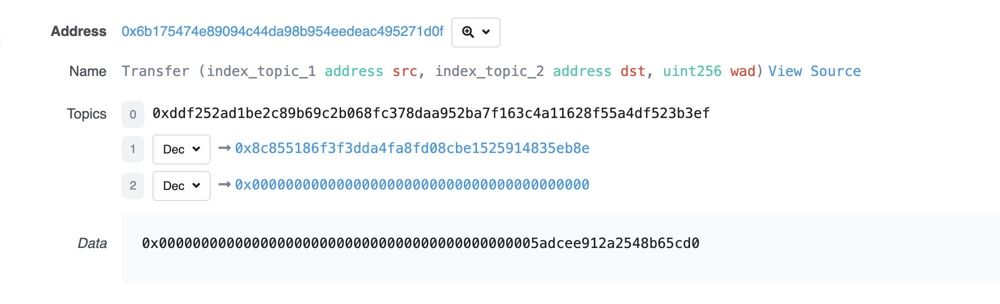

<center>solidity</center>


#### 菱形继承

当时菱形继承时候，当采用super关键字时。会调用继承链条上的每一个合约的相关函数，而不是只调用最近的父合约。


具体来说，遵循C3线性化方法。

此处直接说python的`C3线性化方法`，[solidity官网](https://solidity-cn.readthedocs.io/zh/develop/contracts.html?highlight=%E7%BB%A7%E6%89%BF#index-16)说，两个十分相似

```
class A:
    def method(self):
        print("A.method")

class B(A):
    def method(self):
        print("B.method")
        super().method()

class C(A):
    def method(self):
        print("C.method")
        super().method()

class D(B, C):
    def method(self):
        print("D.method")
        super().method()

d = D()
d.method()
```


运行结果

```
D.method
B.method
C.method
A.method
```


C3 线性化算法基本步骤:

1. **初始化**：
   - 为每个类创建一个列表，包含该类及其所有基类（包括 `object` 类）。
2. **构建 MRO 列表**：
   - 从当前类开始，构建 MRO 列表。将当前类的直接基类列表和每个基类的 MRO 列表合并，遵循以下规则。
3. **合并规则**：
   - 按顺序依次选择基类列表中的第一个类，将其加入结果列表。
   - 如果一个类已经在结果列表中出现过，或者该类在其他基类列表的开头出现，则跳过这个类，选择下一个基类列表的第一个类。
   - 如果所有基类列表的第一个类都不满足条件，则该基类列表无效，抛出异常（这种情况在Python中一般不会发生）。
4. **递归处理**：
   - 对每个基类重复上述步骤，直到处理完所有基类并构建完成最终的 MRO 列表。


实例：

假设继承关系如下：

```
   A
  / \
 B   C
  \ /
   D
```


具体步骤

1. **列出每个类的直接基类**：
   - `D`：`[B, C, D]`
   - `B`：`[A, B]`
   - `C`：`[A, C]`
   - `A`：`[A]`


1. **构建 MRO 列表**：

- 对于类 `D`，其基类列表为 `[B, C, D]`。

  - 从 `D` 开始，直接基类列表为 `[B, C]`。
  - `B` 的 MRO 列表为 `[A, B]`。
  - `C` 的 MRO 列表为 `[A, C]`。

- 合并 `[B, C]`, `[A, B]`, `[A, C]`：

  - 第一个类是 `D` 本身，加入结果。

  - 选择 

    ```
    [B, C]
    ```

     列表的第一个类 

    ```
    B
    ```

    。

    - `B` 加入结果，`B` 从所有列表中移除，剩余 `[C]`, `[A]`, `[A, C]`。

  - 选择 

    ```
    [C]
    ```

     列表的第一个类 

    ```
    C
    ```

    。

    - `C` 加入结果，`C` 从所有列表中移除，剩余 `[]`, `[A]`, `[A]`。

  - 选择 

    ```
    [A]
    ```

     列表的第一个类 

    ```
    A
    ```

    。

    - `A` 加入结果，`A` 从所有列表中移除，剩余 `[]`, `[]`, `[]`。

- 最终 MRO 列表为 `[D, B, C, A]`。


solidity中对应代码的mro列表为`[D,C,B,A]`；是因为solidity中声明继承的时候，距离当前合约名越远的继承基类，实际上继承关系上越靠近当前合约(ps.[官网描述](https://docs.soliditylang.org/en/v0.8.25/contracts.html#multiple-inheritance-and-linearization))。如下：

```solidity
contract A {
    event Log(string msg);
    function foo() public  virtual returns (string memory) {
        emit Log("A.foo");
    }
}

contract B is A {
    function foo() public  override virtual returns (string memory) {
        emit Log("B.foo");
        super.foo();
    }
}

contract C is A {
    function foo() public  override virtual returns (string memory) {
        emit Log("C.foo");
        super.foo();
    }
}

contract D is B, C {
    function foo() public  override(B, C) returns (string memory) {
        emit Log("D.foo");
        super.foo();
    }
}
```


#### gas消耗


消耗完gas的情况：

+ out of gas：消耗完gas还没有执行完交易，则交易回退且不退gas
+ assert：交易回退且不退gas


#### 日志

以太坊虚拟机（EVM）用日志`Log`来存储`Solidity`事件，每条日志记录都包含主题`topics`和数据`data`两部分。



注意第一部分是主题数组，用于描述事件，长度不能超过`4`。它的第一个元素是事件的签名（哈希）。对于上面的`Transfer`事件，它的签名就是：

```
keccak256("Transfer(addrses,address,uint256)")

//0xddf252ad1be2c89b69c2b068fc378daa952ba7f163c4a11628f55a4df523b3ef
```

除了事件签名，主题还可以包含至多`3`个`indexed`参数，也就是`Transfer`事件中的`from`和`to`。


#### 接收以太币


对合约账户，接收以太币使用reveive()接收还是用fallback()接收完全归结与以下

```
触发fallback() 还是 receive()?
           接收ETH
              |
         msg.data是空？
            /  \
          是    否
          /      \
receive()存在?   fallback()
        / \
       是  否
      /     \
receive()   fallback()
```

简单来说，合约接收`ETH`时，`msg.data`为空且存在`receive()`时，会触发`receive()`；`msg.data`不为空或不存在`receive()`时，会触发`fallback()`，此时`fallback()`必须为`payable`。

`receive()`和`payable fallback()`均不存在的时候，向合约**直接**发送`ETH`将会报错（你仍可以通过带有`payable`的函数向合约发送`ETH`）。


#### 发送以太币

三种发送`ETH`的方法：`transfer`，`send`和`call`。

- `call`没有`gas`限制，最为灵活，是最提倡的方法；发送失败不会自动`revert`交易。

  > 即call能够捕获到回滚
- `transfer`有`2300 gas`限制，但是发送失败会自动`revert`交易，是次优选择；
- `send`有`2300 gas`限制，而且发送失败不会自动`revert`交易，几乎没有人用它。


其中call的用法如下：

```solidity
(bool success, bytes memory data) = address.call{value: amount, gas: gasAmount}(callData);
```

其中amount是发送wei数量，gasAmount是关于这次发送的最大gas限制。callData就是calldata字段


#### 调用其他合约


以下是调用其他合约的形式

```solidity
contract CallContract{

    constructor() payable {}

    function callSetX(address _Address, uint256 x)external payable {
        OtherContract(_Address).setX(x);
    }

    function callGetX(OtherContract _A)external  payable returns(uint x ){
        x = _A.getX();
    }    

    function callGetX2(address _a)external  payable returns(uint x){
        OtherContract aa = OtherContract(_a);
        x = aa.getX();
    }

    function callSetX2(address _a,uint256 x)external payable {
        OtherContract(_a).setX{value:msg.value}(x);         // 此处低级调用的形式。“call”则是对于fallback的调用
    }
}
```

> care一下实际上calldata本身就是input --- 代表函数选择器和对应的参数。在remix中自己写calldata也可以直接的进行函数调用，而不用手动去点击。calldata直接对应input，input对应函数选择器和参数


低级调用形式：

```solidity
abi.encodeWithSignature("f(uint256,address)", _x, _addr)
```

```solidity
abi.encodeWithSelector(bytes4(keccak256("f(uint256,address)")), _x, _addr);
```

> 注意注意，`abi.encodeWithSignature`第二个参数不是`abi.encode(_x,_addr)`


#### 合约账户无私钥

合约账户是没有私钥的。

假设我们有以下合约 `A` 和 `B`：

```solidity
// 合约 A
contract A {
    function callB(address _b) public {
        B b = B(_b);
        b.someFunction();
    }
}

// 合约 B
contract B {
    function someFunction() public {
        // 执行某些操作
    }
}

```

+ 用户使用外部账户 `EOA1` 调用合约 `A` 的 `callB` 函数。

+ `EOA1` 生成一个交易并使用其私钥进行签名，然后将交易发送到以太坊网络。

+ 交易被节点验证，通过后，合约 `A` 被调用并执行 `callB` 函数。

+ 在 `callB` 函数中，合约 `A` 调用合约 `B` 的 `someFunction` 函数。

+ 整个过程中，所有调用都是基于初始由 `EOA1` 发起并签名的交易。


#### mempool公开访问


以太坊是一个去中心化的区块链网络，每个节点都有一个自己的 mempool。为了确保交易的透明性和公平性，mempool 的内容是公开的，任何人都可以通过连接到以太坊节点来查看 mempool 中的交易。


访问mempool方式

+ **全节点**：运行以太坊全节点（例如 Geth 或 Parity）可以直接访问 mempool。全节点会存储并管理所有待确认的交易。

+ **区块浏览器**：一些区块浏览器（例如 Etherscan）提供 mempool 的可视化服务，用户可以通过这些工具查看当前未确认的交易。

+ **第三方 API**：一些第三方服务提供 mempool 数据的 API 接口，开发者可以通过这些接口获取 mempool 中的交易信息。
