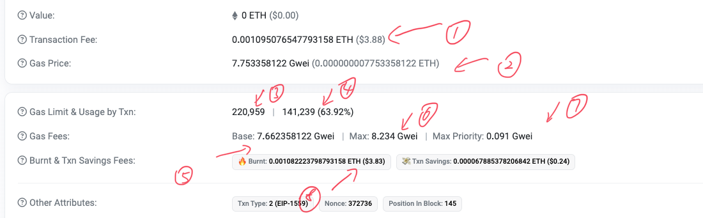

#### 1. N,P,NP,NPC问题

> 解答[视频地址](https://www.bilibili.com/video/BV1pF41127B3/?spm_id_from=333.337.search-card.all.click&vd_source=9259edb9c8692a0e4eb7785a35b3161f)

```
P:可以在多项式时间复杂度内解决的问题
(例如排序问题)
```


```
NP:可以在多项式时间内验证一个解的问题。但是不一定能在多项式时间内求出正确的解
例如：数独问题，验证(非求解)Hamilton回路问题
```


```
NP难 & NP完全

NP难：任意NP问题可以在多项式时间内约化成该问题。
(例如旅行商的求最短回路问题)

NP完全：所有既是NP问题，又是NP难问题的问题。即一个NP问题，任意的NP问题可以约化到它
(例如限制花费时是否可行问题。明显的，这个问题容易验证，并且Hamilton问题可以约化到这个问题上。所以这个问题是NP完全问题。)
```

> 如果遇到一个不能在多项式时间内验证其解的正确性的问题，那么归类的话，只能算到NP难问题 by GPT


#### 2. 非公链的确认问题


联盟链 则是部分去中心化 (或称多中心化) 的区块链, 适用 于多个实体构成的组织或联盟, 其共识过程受到预 定义的一组节点控制, 例如生成区块需要获得 10 个 预选的共识节点中的 5 个节点确认; 私有链则是完 全中心化的区块链, 适用于特定机构的内部数据管 理与审计等, 其写入权限由中心机构控制, 而读取权 限可视需求有选择性地对外开放


#### 3. etherscan

> 稍微解读一下

​	


1. 是总得交易费用，总共需要的花费， 计算公式为

   `Transaction Fee=Gas Used×(Base Fee+Priority Fee)`，

2. 每个gas的价格

3. 用户设置额本次交易的gas数量上限

4. 本次交易实际所使用掉的gas数量，后面是占3的百分比

5. 2中gas单价的具体组成部分。主要看

   1. Base是基本组成，必须的
   2. 可以接受的最大的gas单价
   3. 可以接受的最大小费单价(给矿工的)（一般就是直接收取这么多）


所以总费用为：

Transaction Fee = Gas price * (usage by txn)

​							 = (Base + max priority) * (usage by txn)


#### 4. 交易排序


以太坊和比特币网络上的矿工依然主要依据交易费用的高低来决定打包顺序，但在各自的实现和机制上存在一些差异。

> 以太坊引入了EIP-1559升级，通过基础费用（base fee）和小费（tip）机制来改进交易费用模型，减小交易费用的波动性


以太坊矿工在打包交易时，通常是根据交易的总费用（gas price × gas used）来决定优先级，而不是单纯按照gas price或者gas used。这意味着矿工会优先打包那些总费用最高的交易。

