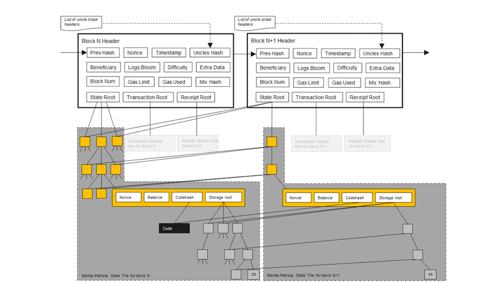
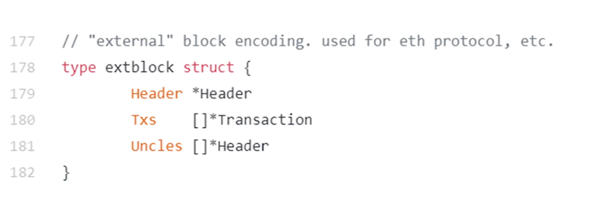

知识点

> 中本聪应该不是学术界出生，否则不太可能设计的出bitcoin这样的系统
>
> -- 不要被学术界的思维限制了头脑，不要被程序员的思维限制了想象力

#### 1. Merkle Patricia Tree

+ 同时具有merkle 和 patricia的特点。
  + 通过key内容拆分进行索引，
  + 通过对节点内容的hash建立索引引用。叶节点变则根节点变.

merkle tree本身还提供merkle proof，其中的逻辑其实很简单。

#### 2. 账户结构

1. **Nonce**：对于外部拥有账户，Nonce是该账户所发送交易的数量。对于合约账户，它表示该合约账户创建的合约数量。Nonce用于防止双重支付和确保交易的唯一性。
2. **余额**（Balance）：账户当前拥有的以太币数量，以wei为单位。1以太币等于 10181018 wei。
3. **存储根**（Storage Root）：这是一个指向账户存储内容的Merkle Patricia Tree的根哈希。对于合约账户，这个树存储了合约的`状态变量`。对于外部拥有账户，这个值通常是一个空的哈希值，因为EOAs不直接存储状态信息。
4. **代码哈希**（Code Hash）：对于合约账户，这是账户代码的Keccak-256哈希值，代表了合约的逻辑和功能。这允许网络验证合约代码的完整性和不变性。对于外部拥有账户，这个值是一个特定的哈希值，表示没有合约代码。

#### 3. 智能合约存储执行

首次创建智能合约时，智能合约的字节码确实是包括在创建合约的交易中的。这个过程通常如下：

--合约部署过程--

1. **编译合约**：首先，您需要将智能合约的源代码（通常是Solidity代码）编译成EVM（以太坊虚拟机）可执行的字节码。这一步是在本地完成的，使用如Solc（Solidity编译器）或其他IDE工具。
2. **创建交易**：然后，您创建一个特殊的以太坊交易，其数据字段包含了编译后的合约字节码。这个交易没有接收方地址，因为它是用于创建新合约的。
3. **发送交易**：将这个交易发送到以太坊网络。矿工将处理这个交易，执行合约的创建过程。
4. **合约创建**：交易被矿工执行时，EVM在区块链上为新合约创建一个新的合约账户，并将交易中的字节码存储到这个账户中。合约的地址是根据交易发送者的地址和其nonce生成的，这确保了每个合约地址的唯一性。
5. **交易确认**：一旦交易被确认并被包括在一个区块中，合约就被认为是“部署”到以太坊网络上。此时，合约就处于可被调用的状态。

智能合约在以太坊上公开，并且可以看成开放应用程序接口。 这意味着你可以在自己的智能合约中调用其他智能合约，以大幅扩展可能的功能。 合约甚至可以部署其他合约。

#### 4. 账户结构

1. **合约代码（Codehash）**：代码hash不是代码。 hash用来定位，代码实际存储在初次的`创建交易`里面。
2. **存储（Storage）**：合约账户的存储是键值对的集合，保存了合约的状态变量。合约的存储是持久的，即使合约调用结束，存储中的数据也不会消失。
3. **余额（Balance）**：合约账户中还有一个以太币余额，合约可以接收和发送以太币，就像外部拥有账户（EOA）一样。
4. **Nonce**：合约账户的Nonce用于记录该合约创建的其他合约数量。

> 代码永久存储在`code`部分
>
> 个人账户只有3,4两个部分

#### 5. 合约地址

**合约地址**是合约账户在以太坊网络中的唯一标识符。它是在合约部署过程中生成的，基于部署合约的交易发起者（即EOA的地址）和该账户的交易计数（nonce）计算得出

#### 6. 状态树

状态树中，保存全世界所有的外部 and 合约账户状态，其中存储树根的hash保存在状态树保存的账户的字段里面。其为Merkle Patricia Tree，要定位具体的value可以通过计算hash得到

#### 7. 交易树

三种交易类型：

1. 转账
2. 合约创建
3. 合约执行

#### 8. 以太坊同步

同步将验证整个以太坊链的交易，花费大量时间。

#### 9. EVM 

主要特点

- **沙箱环境**：EVM为每个智能合约提供了一个隔离的执行环境，这意味着运行在EVM上的代码无法访问网络、文件系统或其他进程。这种设计提高了安全性，防止了恶意合约影响到节点或网络的其他部分。
- **确定性**：EVM设计为确定性执行环境，意味着对于相同的输入，无论在哪个节点上运行，智能合约都会产生相同的输出。这是实现全网共识的关键要求。
- **以太坊特有的指令集**：EVM有自己的字节码指令集，智能合约开发者通常使用高级语言（如Solidity或Vyper）编写合约，然后编译成EVM可以理解的字节码进行执行。
- **基于堆栈的执行**：EVM是一个基于堆栈的虚拟机，它支持复杂的数据结构和控制流，使得开发复杂的智能合约成为可能。
- **Gas机制**：以太坊通过Gas机制限制和计量智能合约的资源消耗（计算、存储等）。每个操作都有相应的Gas成本，执行合约的过程中消耗的Gas需要由发起者支付，以防止恶意计算或无限循环攻击。

#### 10. Uniswap

大概是基于AMM的去中心化交易所。DEX和传统的CEX不同，不采用传统的订单铺模式，而是采用AMM的机制进行去中心化交易。

> 想要做金融还是要进行研究才对。

#### 11. hash指针

用hash来制定，而不是 普通指向内存的指针

当前块之前的区块的同步，只需要验证hash正确就行了

#### 12. 

bitcoin/src/primitives/block.h

block定义文件

#### 13.

selfish ming

优势：有助于减少下一区块的竞争

劣势：可能会导致当前挖出的块不被认可。导致资产损失 

#### 14. 挖矿

#### 15. block结构

#### 16. p2pkh和p2pk

两者的主要（唯一）区别，就是前者绑定的是签名。后者绑定的是公钥

> 北京大学肖臻老师《区块链技术与应用》公开课的P9中的18:08有关于p2sh的执行过程

> 现在的多重签名，将复杂性。交给了接受方。而不是转移方
>
> 

(ps.还有一种指令是return，proof of burn)

#### 17. fork

state fork->forking attack-> deliberate attack

protocol fork -> hard fork、soft fork

##### hard fork

block size limit

> 常规bitcoin block，一分钟5~7个交易

新节点能够向前兼容。但是旧节点不能够向后兼容。导致block_chain发生无法避免的分叉。这时候就发展称为了两条链

> 一个小trick，如果只是去改变协议。其他的啥都不改，可能会导致一次交易在两条链上同时发生。导致可能ETC和ETH的币都转给同一个地址。然后就添加了`ChainId`，至此，两条链全部分开

##### soft fork

新节点不能够向前兼容。但是旧节点能够向后兼容。由于新节点的算力较强 且 老节点也接受。发生分叉时，新节点的链总能成功，导致老节点区块一直不能够使用，从而一直无法获得挖矿奖励。

> 并且由于新节点不认老节点的区块，所以整条链上都不会再有老节点的区块。 （ps .从而逼迫老节点更新）
>
> example: P2SH

##### 交易费

total inputs > total outputs 差额即为交易费本身

#### 匿名性

> 比特币的匿名性没有那么好，特别是从事`违法活动`的时候。相对于个人的匿名性还好，对于某些组织`FBI`很难做到匿名
>
> 能保持匿名性，不能消除关联性

bitcoin是伪匿名的。现金匿名是极好的。如果银行允许使用化名，那么其匿名性比bitcoin更好， 因为账本更加保密。

+ 透明的转账交易会让地址关联到一起，不如银行好。并且可能转账的找零地址可能会被找出来。
+ bitcoin区块和现实世界存在交互的时候，可能会被发现。比如说法币兑换、网上支付。并且全网都可能会被知道，邻居可能会监控你的支付时间，然后去区块链网上去插，反复几次就能够推测出账户本身。 

##### 匿名性实现

网络层： 多路径转发`例如tor网络`

应用层：coin mixing`有点像应用层的多路径转发`、

[肖臻视频地址](https://www.bilibili.com/video/BV1Vt411X7JF?t=2568.6&p=12)

##### 零知识证明

上面第一步，银行是不知道SerialNum的。只看得到盲化后的消息，不知道真实内容。

> 需要注意的是，盲签名本质上是为了保护消息发送者的隐私，而不是用来审查消息内容的合法性。 --by chatGPT

注意，zcash这些更强的加密货币，只是尽量去消除`关联性`。而对于`和现实世界产生交互`这一点，仍然无法 避免。现在的数字货币仍然无法解决这个问题。

#### 思考

##### 稀缺性

稀缺的东西是不适合作为货币的。由于总量确定，然而社会创造财富的速度加快。所以必定这种`稀缺`的货币必然会升值。从而导致，价值的迅速升高(因为其货币价值和每年社会价值产生速度相关)。从而导致以前上车的人，啥都不干都能够过得很好。然后，后面没有上车的人，永远一辈子都上不了车，从而导致财富的分配不均，引发社会性问题。

> 一种货币本身应该拥有通货膨胀的功能。以太坊就没有区块奖励减半限制。所以现代黄金就不能当作货币

##### 量子计算机

+ 量子计算机离实用还很远，
+ 就算死，也是传统金融先死。现代金融体系中 加密货币只占用很小部分。
+ 并且，bitcoin本身还用地址来做一层公钥的保护。hash拥有比公钥算法更好的安全性。公钥体系，需要从密文中还原出明文。但是hash并不需要。而且在hash正向计算过程中，很多信息都已经丢失了，如果要还原出来的话，即使能够。也会发生hash碰撞的情况，而这时候不同的`还原出来的明文`。需要各个区找密钥
+ 收钱是不需要暴露公钥的，发钱才需要。然后即使是量子计算机，也没办法在你发布交易后`(比如说窃听)`。在你的交易打包进区块的这10分钟内，破解你的私钥。并且还要竞争上block

### 以太坊 

mining puzzle ,相对于比特币。以太坊使用的minning puzzle 对内存要求更高，而不是计算要求(asci resistance)

智能合约好处： 

+ 不同国家、不同司法管辖权情况下，提供公信力背书。（这种很难通过司法手段）
+ 比现实生活中的司法手段更加有力、快捷、方便。不用拖时间打官司

#### 账户

天生对`双花`有防御作用，但是对于`replay attack`

##### 外部账户

+ balance
+ nonce

##### 合约账户

+ balance
+ nonce(可能还会调用其他合约账户)
+ code
+ storage

> 创建合约时候会返回地址，知道地址就能调用合约

##### 状态树

+ hash表：无法通过merkle proof来证明余额。

+ merkle 树：

  + 采用没有排序的merkle树，那么每一次区块的发布，如果要进行同步的话。就会大量修改merkle树（账户顺序有很多组合）。
  + 采用排序merkle树，在需要插入的时候。需要大量的更改

+ trie`来自retrieval，翻译字典树`

  + 节点范围`0-16`+`一个结束标志位`

  + 更新具有局部性，不用访问全部节点。想更新哪里，直接更新就好

  + patricia trie，路径压缩前缀树

  + Modified MPT`如下`

    

    + 存在`Extension Node`，则进行了路径压缩
    + 所有看似`取地址`的操作，实际上都换成了`Hash值`。并且这里的key就是账户地址，value对应账户内容

  + 只有修改(更新)后的节点才需要 记录下来。不修改的地方直接引用

    

    + 不变的地方直接引用hash即可
    + 每个全节点，不是需要维护一颗MPT。而是每次出现一个区块都要新建一个mpt，只不过大部分都是共享的。历史记录也有助于回滚

+ 区块头内容：

  + 
  + ParentHash:前一区块，区块头的hash
  + UncleHash:
  + Bloom：未决
  + MixDigest：未决

+ 区块结构：

  + 
  + header:指向block_header的指针
  + transaction：当前区块交易列表

+ 真正在网上发布的信息：

  

  ​	以上才是真正在网上发布的信息。

+ RLP：真正在状态树中保存的value内容

以太坊区块头中只有state root，那么修改后的MPT怎么表现出来喃？ 存放在区块中？ -- 未决
