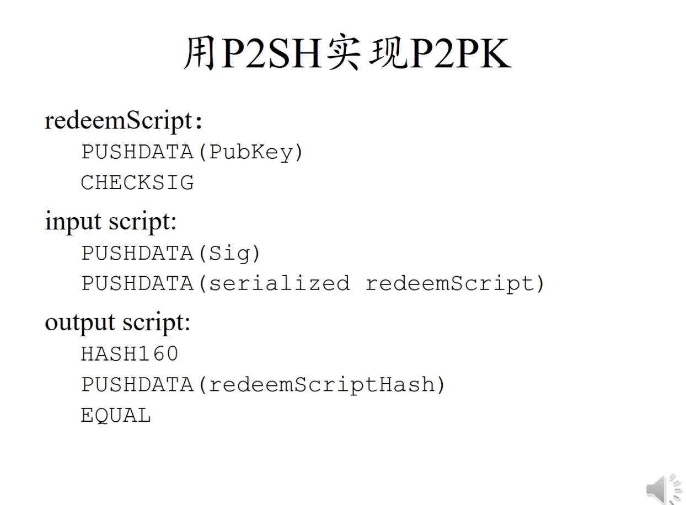

<center>知识点</center>

> 中本聪应该不是学术界出生，否则不太可能设计的出bitcoin这样的系统
>
> -- 不要被学术界的思维限制了头脑，不要被程序员的思维限制了想象力

  


#### 1. Merkle Patricia Tree

+ 同时具有merkle 和 patricia的特点。
  + 通过key内容拆分进行索引，
  + 通过对节点内容的hash建立索引引用。叶节点变则根节点变.


merkle tree本身还提供merkle proof，其中的逻辑其实很简单。


#### 2. 账户结构

1. **Nonce**：对于外部拥有账户，Nonce是该账户所发送交易的数量。对于合约账户，它表示该合约账户创建的合约数量。Nonce用于防止双重支付和确保交易的唯一性。
2. **余额**（Balance）：账户当前拥有的以太币数量，以wei为单位。1以太币等于 10181018 wei。
3. **存储根**（Storage Root）：这是一个指向账户存储内容的Merkle Patricia Tree的根哈希。对于合约账户，这个树存储了合约的`状态变量`。对于外部拥有账户，这个值通常是一个空的哈希值，因为EOAs不直接存储状态信息。
4. **代码哈希**（Code Hash）：对于合约账户，这是账户代码的Keccak-256哈希值，代表了合约的逻辑和功能。这允许网络验证合约代码的完整性和不变性。对于外部拥有账户，这个值是一个特定的哈希值，表示没有合约代码。


#### 3. 智能合约存储执行

首次创建智能合约时，智能合约的字节码确实是包括在创建合约的交易中的。这个过程通常如下：


--合约部署过程--

1. **编译合约**：首先，您需要将智能合约的源代码（通常是Solidity代码）编译成EVM（以太坊虚拟机）可执行的字节码。这一步是在本地完成的，使用如Solc（Solidity编译器）或其他IDE工具。
2. **创建交易**：然后，您创建一个特殊的以太坊交易，其数据字段包含了编译后的合约字节码。这个交易没有接收方地址，因为它是用于创建新合约的。
3. **发送交易**：将这个交易发送到以太坊网络。矿工将处理这个交易，执行合约的创建过程。
4. **合约创建**：交易被矿工执行时，EVM在区块链上为新合约创建一个新的合约账户，并将交易中的字节码存储到这个账户中。合约的地址是根据交易发送者的地址和其nonce生成的，这确保了每个合约地址的唯一性。
5. **交易确认**：一旦交易被确认并被包括在一个区块中，合约就被认为是“部署”到以太坊网络上。此时，合约就处于可被调用的状态。


智能合约在以太坊上公开，并且可以看成开放应用程序接口。 这意味着你可以在自己的智能合约中调用其他智能合约，以大幅扩展可能的功能。 合约甚至可以部署其他合约。


#### 4. 账户结构


1. **合约代码（Codehash）**：代码hash不是代码。 hash用来定位，代码实际存储在初次的`创建交易`里面。
2. **存储（Storage）**：合约账户的存储是键值对的集合，保存了合约的状态变量。合约的存储是持久的，即使合约调用结束，存储中的数据也不会消失。
3. **余额（Balance）**：合约账户中还有一个以太币余额，合约可以接收和发送以太币，就像外部拥有账户（EOA）一样。
4. **Nonce**：合约账户的Nonce用于记录该合约创建的其他合约数量。

> 合约账户的字节码会单独的存在一个数据库里面(ps.而不是存放在Codehash字段中)， 然后通过其字节码的hash值来进行定位
>
> 个人账户只有3,4两个部分


#### 5. 合约地址

**合约地址**是合约账户在以太坊网络中的唯一标识符。它是在合约部署过程中生成的，基于部署合约的交易发起者（即EOA的地址）和该账户的交易计数（nonce）计算得出


#### 6. 状态树

状态树中，保存全世界所有的外部 and 合约账户状态，其中存储树根的hash保存在状态树保存的账户的字段里面。其为Merkle Patricia Tree，要定位具体的value可以通过计算hash得到


#### 7. 交易树


三种交易类型：

1. 转账
2. 合约创建
3. 合约执行


#### 8. 以太坊同步


同步将验证整个以太坊链的交易，花费大量时间。


#### 9. EVM 

主要特点

- **沙箱环境**：EVM为每个智能合约提供了一个隔离的执行环境，这意味着运行在EVM上的代码无法访问网络、文件系统或其他进程。这种设计提高了安全性，防止了恶意合约影响到节点或网络的其他部分。
- **确定性**：EVM设计为确定性执行环境，意味着对于相同的输入，无论在哪个节点上运行，智能合约都会产生相同的输出。这是实现全网共识的关键要求。
- **以太坊特有的指令集**：EVM有自己的字节码指令集，智能合约开发者通常使用高级语言（如Solidity或Vyper）编写合约，然后编译成EVM可以理解的字节码进行执行。
- **基于堆栈的执行**：EVM是一个基于堆栈的虚拟机，它支持复杂的数据结构和控制流，使得开发复杂的智能合约成为可能。
- **Gas机制**：以太坊通过Gas机制限制和计量智能合约的资源消耗（计算、存储等）。每个操作都有相应的Gas成本，执行合约的过程中消耗的Gas需要由发起者支付，以防止恶意计算或无限循环攻击。


#### 10. Uniswap

大概是基于AMM的去中心化交易所。DEX和传统的CEX不同，不采用传统的订单铺模式，而是采用AMM的机制进行去中心化交易。

> 想要做金融还是要进行研究才对。


#### 11. hash指针

用hash来制定，而不是 普通指向内存的指针


当前块之前的区块的同步，只需要验证hash正确就行了


> 比特币的区块hash并不是对整个区块进行hash，而只是对区块头进行hash


#### 12. 

bitcoin/src/primitives/block.h

block定义文件


#### 13.

selfish ming

优势：有助于减少下一区块的竞争

劣势：可能会导致当前挖出的块不被认可。导致资产损失 


#### 14. 挖矿


#### 15. block结构


#### 16. p2pkh和p2pk

> 用于bitcoint中的交易脚本
>
> [可编程支付原理](https://www.liaoxuefeng.com/wiki/1207298049439968/1311929802948641)
>
> 通过多签脚本取bitcoin的时候，不仅需要提供私钥。还需要提供`Redeem Script`(赎回脚本)


p2pk交易脚本


p2pkh脚本


两者的主要（唯一）区别，就是前者绑定的是签名。后者绑定的是公钥


##### p2sh实现p2pk




> 其中第二阶段使用的是第一阶段的结果进行运算，这里redeem脚本的执行老师没有讲。而是跳过了，说的是redeemscript脚本是由各个节点来自己单独执行的。结果好像是会的到一个PubKey。


##### 多签


> 上古时代的多签过程，通过软分叉在bitcoin中进行更新实现的。
>
> 由于把签名的复杂性交给了用户，所以导致不常用。


> 给出的m个签名的顺序要和他们在N个公钥中的相对顺序一样
>
> 重点是其中的checkmultisig这条命令(ps.具体细节暂不纠)


##### p2sh实现多签 

> 北京大学肖臻老师《区块链技术与应用》公开课的P9中的18:08有关于p2sh的执行过程

> 现在的多重签名，将复杂性。交给了接受方。而不是转移方
>
> 

> 对应p2sh交易脚本来说，不只是需要对应的签名还需要赎回脚本才能够取出bitcoin
>
> 
>
> redeemscript脚本形式:p2ph、p2pkh、多签形式

(ps.还有一种指令是return，proof of burn)


###### 脚本执行过程

+ 第一阶段


+ 第二阶段-redeem-script脚本执行


> 第二阶段的验证过程和前面直接使用checkmultisig的情况是类似的


#### 17. fork


state fork->forking attack-> deliberate attack


protocol fork -> hard fork、soft fork


##### hard fork

block size limit

> 常规bitcoin block，一分钟5~7个交易

新节点能够向前兼容。但是旧节点不能够向后兼容。导致block_chain发生无法避免的分叉。这时候就发展称为了两条链

> 一个小trick，如果只是去改变协议。其他的啥都不改，可能会导致一次交易在两条链上同时发生。导致可能ETC和ETH的币都转给同一个地址。然后就添加了`ChainId`，至此，两条链全部分开


##### soft fork

新节点不能够向前兼容。但是旧节点能够向后兼容。由于新节点的算力较强 且 老节点也接受。发生分叉时，新节点的链总能成功，导致老节点区块一直不能够使用，从而一直无法获得挖矿奖励。

> 并且由于新节点不认老节点的区块，所以整条链上都不会再有老节点的区块。 （ps .从而逼迫老节点更新）
>
> example: P2SH


##### 交易费

total inputs > total outputs 差额即为交易费本身


#### 18. 粉尘攻击

[粉尘攻击简介](https://weibo.com/ttarticle/p/show?id=2309354570196491764023)


#### 19. 合约调用


当一个合约调用另一个合约时，不需要再发起一笔新的交易，更加不用会被当成交易打包进区块里面。这种调用是直接在当前交易的执行上下文中进行的。如下：

```solidity
EOA调用合约A:
	交易由EOA签名并发送，矿工将其打包进区块，执行合约A的函数。(ps.在合约A中，msg.sender是发起交易的EOA。)
	
	在合约A的代码执行过程中，合约A调用合约B的函数。(ps.在合约B中，msg.sender是合约A，而tx.origin是原始交易的发起者（EOA）。)
```


当外部账户调用合约的时候，则需要发起交易才行。


#### 20. try catch

>  `solidity`中，`try-catch`只能被用于`external`函数或创建合约时`constructor`（被视为`external`函数）的调用

`catch Error(string memory reason)`,和`catch (bytes memory reason)`分别对应`revert() 和 require()`和`assert()`

```solidity
    // executeNew(2)会成功并释放`SuccessEvent`
    function executeNew(uint a) external returns (bool success) {
        try new OnlyEven(a) returns(OnlyEven _even){
            // call成功的情况下
            emit SuccessEvent();
            success = _even.onlyEven(a);
        } catch Error(string memory reason) {
            // catch失败的 revert() 和 require()
            emit CatchEvent(reason);
        } catch (bytes memory reason) {
            // catch失败的 assert()
            emit CatchByte(reason);
        }
    }
```


#### 21. 以太坊签名


过程：

**1. 打包消息：** 在以太坊的`ECDSA`标准中，被签名的`消息`是一组数据的`keccak256`哈希，为`bytes32`类型。我们可以把任何想要签名的内容利用`abi.encodePacked()`函数打包，然后用`keccak256()`计算哈希，作为`消息`。我们例子中的`消息`是由一个`address`类型变量和一个`uint256`类型变量得到的：

```solidity
    /*
     * 将mint地址（address类型）和tokenId（uint256类型）拼成消息msgHash
     * _account: 0x5B38Da6a701c568545dCfcB03FcB875f56beddC4
     * _tokenId: 0
     * 对应的消息msgHash: 0x1bf2c0ce4546651a1a2feb457b39d891a6b83931cc2454434f39961345ac378c
     */
    function getMessageHash(address _account, uint256 _tokenId) public pure returns(bytes32){
        return keccak256(abi.encodePacked(_account, _tokenId));
    }
```


**2. 计算以太坊签名消息：** `消息`可以是能被执行的交易，也可以是其他任何形式。为了避免用户误签了恶意交易，`EIP191`提倡在`消息`前加上`"\x19Ethereum Signed Message:\n32"`字符，并再做一次`keccak256`哈希，作为`以太坊签名消息`。经过`toEthSignedMessageHash()`函数处理后的消息，不能被用于执行交易:

```solidity
    /**
     * @dev 返回 以太坊签名消息
     * `hash`：消息
     * 遵从以太坊签名标准：https://eth.wiki/json-rpc/API#eth_sign[`eth_sign`]
     * 以及`EIP191`:https://eips.ethereum.org/EIPS/eip-191`
     * 添加"\x19Ethereum Signed Message:\n32"字段，防止签名的是可执行交易。
     */
    function toEthSignedMessageHash(bytes32 hash) internal pure returns (bytes32) {
        // 哈希的长度为32
        return keccak256(abi.encodePacked("\x19Ethereum Signed Message:\n32", hash));
    }
```


#### 22. 锁定流动性


**LP代币的基本工作原理**

当用户将资金（比如ETH和DAI）存入Uniswap等DEX的流动性池时，他们会收到代表其贡献份额的LP代币。这些LP代币的数量基于投入的资产的相对价值。用户可以随时将这些LP代币返回到DEX来赎回其原始投入的资产和可能的交易费用收益。

风险场景：项目方撤走流动性

考虑以下情况：

1. **项目方大量撤走流动性**：如果项目方控制着大量的LP代币并突然决定将这些LP代币兑换成底层资产（ETH和DAI），他们可以从流动性池中撤走大量的ETH和DAI。
2. **对其他流动性提供者的影响**：项目方的这种行为会导致流动性池的资金急剧减少，这意味着剩下的流动性提供者所持有的LP代币代表的底层资产价值会大幅降低。这是因为流动性池中的总资金减少了，而剩余流动性提供者的LP代币数量没有变化。
3. **价格冲击和无常损失**：当大量资金被突然撤出时，会导致相关资产的价格在池中急剧变化，这可能会对剩余资产的价值产生不利影响，即所谓的“无常损失”。此外，由于资金的急剧减少，流动性变差，剩下的流动性提供者在尝试兑换他们的LP代币时可能会遇到不利的价格条件


#### 匿名性

> 比特币的匿名性没有那么好，特别是从事`违法活动`的时候。相对于个人的匿名性还好，对于某些组织`FBI`很难做到匿名
>
> 能保持匿名性，不能消除关联性

bitcoin是伪匿名的。现金匿名是极好的。如果银行允许使用化名，那么其匿名性比bitcoin更好， 因为账本更加保密。

+ 透明的转账交易会让地址关联到一起，不如银行好。并且可能转账的找零地址可能会被找出来。
+ bitcoin区块和现实世界存在交互的时候，可能会被发现。比如说法币兑换、网上支付。并且全网都可能会被知道，邻居可能会监控你的支付时间，然后去区块链网上去插，反复几次就能够推测出账户本身。 


##### 匿名性实现

网络层： 多路径转发`例如tor网络`

应用层：coin mixing`有点像应用层的多路径转发`、

[肖臻视频地址](https://www.bilibili.com/video/BV1Vt411X7JF?t=2568.6&p=12)


##### 零知识证明


上面第一步，银行是不知道SerialNum的。只看得到盲化后的消息，不知道真实内容。

> 需要注意的是，盲签名本质上是为了保护消息发送者的隐私，而不是用来审查消息内容的合法性。 --by chatGPT


注意，zcash这些更强的加密货币，只是尽量去消除`关联性`。而对于`和现实世界产生交互`这一点，仍然无法 避免。现在的数字货币仍然无法解决这个问题。


#### 思考


##### 稀缺性

稀缺的东西是不适合作为货币的。由于总量确定，然而社会创造财富的速度加快。所以必定这种`稀缺`的货币必然会升值。从而导致，价值的迅速升高(因为其货币价值和每年社会价值产生速度相关)。从而导致以前上车的人，啥都不干都能够过得很好。然后，后面没有上车的人，永远一辈子都上不了车，从而导致财富的分配不均，引发社会性问题。

> 一种货币本身应该拥有通货膨胀的功能。以太坊就没有区块奖励减半限制。所以现代黄金就不能当作货币


##### 量子计算机


+ 量子计算机离实用还很远，
+ 就算死，也是传统金融先死。现代金融体系中 加密货币只占用很小部分。
+ 并且，bitcoin本身还用地址来做一层公钥的保护。hash拥有比公钥算法更好的安全性。公钥体系，需要从密文中还原出明文。但是hash并不需要。而且在hash正向计算过程中，很多信息都已经丢失了，如果要还原出来的话，即使能够。也会发生hash碰撞的情况，而这时候不同的`还原出来的明文`。需要各个区找密钥
+ 收钱是不需要暴露公钥的，发钱才需要。然后即使是量子计算机，也没办法在你发布交易后`(比如说窃听)`。在你的交易打包进区块的这10分钟内，破解你的私钥。并且还要竞争上block


#### 洗币


通过将用户的加密货币与他人的加密货币混合，然后重新分配，这样可以使得追踪资金流向变得更加困难，从而保护用户的隐私。

> (ps. 具体百度)


### 以太坊 


mining puzzle ,相对于比特币。以太坊使用的minning puzzle 对内存要求更高，而不是计算要求(asci resistance)


智能合约好处： 

+ 不同国家、不同司法管辖权情况下，提供公信力背书。（这种很难通过司法手段）
+ 比现实生活中的司法手段更加有力、快捷、方便。不用拖时间打官司


#### 账户

天生对`双花`有防御作用，但是对于`replay attack`


##### 外部账户

+ balance
+ nonce


##### 合约账户

+ balance
+ nonce(可能还会调用其他合约账户)
+ code
+ storage

> 创建合约时候会返回地址，知道地址就能调用合约


##### 状态树


+ hash表：无法通过merkle proof来证明余额。

+ merkle 树：

  + 采用没有排序的merkle树，那么每一次区块的发布，如果要进行同步的话。就会大量修改merkle树（账户顺序有很多组合）。
  + 采用排序merkle树，在需要插入的时候。需要大量的更改

+ trie`来自retrieval，翻译字典树`

  + 节点范围`0-16`+`一个结束标志位`

  + 更新具有局部性，不用访问全部节点。想更新哪里，直接更新就好

  + patricia trie，路径压缩前缀树

  + Modified MPT`如下`

    

    + 存在`Extension Node`，则进行了路径压缩
    + 所有看似`取地址`的操作，实际上都换成了`Hash值`。并且这里的key就是账户地址，value对应账户内容
    + 注意：这里的MPT树，每个leaf Node进行了修改的话。那么branch node里面的指针也会变，就是说Branch node也会变。这种逻辑下去，一直到顶层的root node的地址也会变，导致区块头里面的state root也会变(ps.这里应该Extension Node 和Branch Node都是实际放在内存里面的节点，而不是单纯计算出来的值)。

  + 只有修改(更新)后的节点才需要 记录下来。不修改的地方直接引用

    

    + 不变的地方直接引用hash即可
    + 每个全节点，不是需要维护一颗MPT。而是每次出现一个区块都要新建一个mpt，只不过大部分都是共享的。历史记录也有助于回滚[肖臻老师讲解](https://www.bilibili.com/video/BV1Vt411X7JF?t=3453.4&p=16)

+ 区块头内容：

  + 
  + ParentHash:前一区块，区块头的hash
  + UncleHash:
  + Bloom：未决
  + MixDigest：未决

+ 区块结构：

  + 
  + header:指向block_header的指针
  + transaction：当前区块交易列表

+ 真正在网上发布的信息：

  

  ​	以上才是真正在网上发布的信息。


+ RLP：真正在状态树中保存的value内容


#### 交易、收据树

P17没太听懂,从头到中没听懂

> 交易树包含交易，收据树包含收据用`bloom filter`


+ bloom filter。区块头中的`bloom filter`域，是收据树的`bloom filter`做并集合成的 `bloom filter本身是用来收据树的`
+ 交易树、状态  树。`(对于交易树和收据树，理解还是不够深刻)`
+  每个`交易`的执行都会产生一个`收据`，收据结构如下:

  + 

  + 以太坊的`bloom filter`的代码实现

  + 

  + > 注意bloom9中的加密操作 


#### ghost

> 主要是在十几秒的同步中，可能会导致频繁的分叉。导致大矿池在分叉中更占优，从而挫伤小矿工利益，让独立人更不愿意去挖矿。

+ `mining centralization`：主要表现在以太坊中。uncle区块能够得到7/8个以太币，侄子还能一个uncle，一个1/32。最多两个uncle
  + 为避免当前块不包含特定的叔叔块，所以以太坊中不论资排辈。`几代以内就可以，包了就行`
  +   侄子区块和叔叔区块必须在7代以内。`收益2/8 ~ 7/8`
  + 鼓励小矿工参与竞争，对抗挖矿中心化趋势


以太坊区块头中只有state root，那么修改后的MPT怎么表现出来喃？ 存放在区块中？ -- 未决


#### memory hard mining


##### scrypt

+ 内存访问频繁，开大数组，便于计算后保存。不保存的话，就需要重新算，太浪费时间。
  + 从种子节点进行运算，得到第一个元素。而后依次取hash得到后面各位元素。


##### 以太坊

> 挖矿挖矿算法----ethash

+ 读16 m的cache，按照伪随机顺序读取256个数。然后填入DAG的第一个元素位置。其他位置也是如此
+ 根据block_header和nonce按照伪随机顺序读取128个元素。最后算出一个hash值来，和挖矿的目标阈值比较，通过则ok。不通过则换nonce重新算


以太坊伪代码：


> 其中，`get_int_from_item`就是从当前hash得到下一地址的函数。`make_item`就是根据当前hash和当前index，计算下一个hash。


+ 其他概念：
  + pre-mining:
  + pre-sale:用卖出pre-sale的钱，换取资产。以自助相关开发、社区。
  + (上图中，绝大部分都是pre-mining得到的。)


#### 难度调整算法

> 实际上， 和bitcoin遵循`最长合法链`不同，ethereum遵循`最难合法链`。


> Hi是区块的序号。


> 对应代码[视频地址](https://www.bilibili.com/video/BV1Vt411X7JF?t=1316.7&p=20)


#### pos

  

`AltCoin Infanticide` 

+ 维护pow安全性的资源，不是一个闭环。而对于权益证明pos的就是一个闭环`(ps.还是不是很懂)`。 

  + 攻击pow的成本从外界获得。攻击pos的成本从区块链内部获得，那么就会导致`还是不是很懂`，[链接地址](https://www.bilibili.com/video/BV1Vt411X7JF?t=765.2&p=21)

+ `proof of deposit`：投入到当前区块挖掘的币，会被锁定一段时间。然后才能够继续投入到新的区块 的挖掘

+ `nothing at stake`：分叉时候的`算力(投入挖当前区块的币)`，挖分叉的链不构成浪费。从而造成在pos对于分叉的放纵。

+ `Casper--Casper the Friendly Finality Gadget (FFG)` ，Finality是一种最终的状态。包含在finality中的交易不会被取消。而单纯基于pow挖矿的交易是有可能被回滚的。

+ `validator`：`validator`质押一定数量的以太币，然后进行投票。机制有点像数据库的两阶段投票(还是有点不同)。投票选中的epoch则为正统的epoch`类同于检查点`，为有效链。对于不投票和分叉都投票的epoch进行处罚。当过一段时间`validator`之后，需要等待一段时间才能继续当`validator`

+ 理论上能够改写已经确认的epoch，但是需要

  + 需要质押大量的ETH以获得足够的验证者权重
  + 面临着被惩罚的风险，可能失去一部分或所有质押的ETH。`环签名`

  > 并且对于这种攻击，必定至少会有1/3的验证者投了两条链。具体原因根据[这里](https://www.bilibili.com/video/BV1Vt411X7JF?t=2218.6&p=21)自己想


pos观点：

+ 浪费电，反正都是矿池买矿机挖矿。拼的还是钱，那直接把钱掏出来比一比不就好了吗


另一种观点：

+ 电力成本主要在传输和存储上， 发电本身成本不高。而挖矿就是一种将过剩的电能转化为经济的手段，对于一些风能、水力等自然资源发的电力特别有用。白天电不够用，晚上电用不完


poh: **Proof of History** 

> PoH 通过生成一个可验证的时间戳序列，记录事件发生的顺序。
> 时间戳是由连续的哈希操作生成的，每个哈希输出作为下一个哈希的输入，这样可以形成一个链式结构，确保事件的顺序不可篡改。
>
> 由于事件的时间顺序是预先确定的，节点在验证交易时只需要检查时间戳的正确性，而不需要通过传统的 PoW 或 PoS 机制进行大量计算。
>
> solana采用poh和pos的结合情况


智能合约：

> 调用过程：先往地址0发一笔转账交易，转账金额是0。然后把智能合约的代码 放到data域里面。矿工把智能合约发布到以太坊后，返回一个合约账户地址。调用时候，智能合约有他的合约账户，里面有他的状态信息。

demo代码：


 


调用的trascation:


调用方式：

+ 直接调用：

  + 

  

  + 
  + 


合约账户转账须知：

+ 至少需要一个有payable的fullback函数


##### 创建

> EVM：通过加一层虚拟机，对智能合约的运行提供一个一致性的平台。和jvm类似


> gasused：当前区块所有交易已经使用的gas费用
>
> gaslimit：当前区块所有交易最多使用的汽油量
>
> 区块链里有一笔转账发布上去的话，本来就是需要所有的全节点都执行。这样才可以很好的同步状态，更新3棵树内容。
>
> 只有执行交易才能够更新3棵树的内容，发布的区块里没有这3棵树的内容，只是块头里有根hash值
>
> 智能合约不能产生真正的随机数


 


可能导致黑客攻击的黑客代码：


> 这个例子中，所有的钱都会被锁定到合约账户中。


第二版漏洞代码：


> 当智能合约给攻击者转账时候，会触发攻击者的fullback函数。并且fullback函数会再去调用withdraw函数，然后进行递归调用。把合约账户所有钱转给攻击者账户

一般来说经典的编程模式。

+ 判断条件
+ 改变条件
+ 和别的合约发生交互

 


##### 反思

> Irrevocability is a double edeged sword
>
> Nothing is irrevocable 
>
> Is solidity the right programming language?
>
> Many eyeball fallacys
>
> what does decentralization mean?
>
> decentralized != distributed
>
> ​		mission critical applications for state machine. 智能合约只适合在互不信任的实体间建立共识，用来编写控制逻辑
>
> ps.最后the DAO解决方案，是先软分叉锁定黑客和 参与the DAO项目账户的以太币。然后在后续特定区块处进行硬分叉，发布的软件升级方案是，直接通过硬编码的方式。将黑客盗取的、the DAO剩余的，全部强制发给一个退款的智能合约。
>
> > [视频地址](https://www.bilibili.com/video/BV1Vt411X7JF?p=24&vd_source=9259edb9c8692a0e4eb7785a35b3161f)


#### 美链


漏洞代码：


 

细节：


> 还是算术溢出所导致漏洞攻击


##### 其他

> 其他关于blockchain技术的问题、反思。[在这里](https://www.bilibili.com/video/BV1Vt411X7JF/?p=26&spm_id_from=pageDriver&vd_source=9259edb9c8692a0e4eb7785a35b3161f)


> Is decentralization always a good thing?


#### 安全相关

[视频地址](https://www.bilibili.com/video/BV1YM411J7oS?t=7.7&p=7)


##### 基础知识


入手点：

+ 用户可控的输入输出点
+ 危险函数，反向去寻找是否存在可控的输入输出点


> 以用户可控输入输出点为起始。将代码进行模块分类(如上)，
>
> + 节点配置模块--以太坊黑色情人节
> + p2p通信模块--异形攻击
> + RPC接口模块--JSON-RPE安全
> + 智能合约模块--智能合约安全(角色分解)


> 上面这些只是最最基础的。实际上真正的攻防更加严峻，变体更加的多


#### 助记词


助记词生成,[地址](https://github.com/bitcoin/bips/blob/master/bip-0039.mediawiki)

+ 生成32倍数长度的随机数，例如128-256位。假设得到结果位`ent`
+ 生成校验和，“校验和=取前几位的sha256(`ent`/32)” 
+ 将校验和附加到初始值的末尾，
+ 将随机数按照一组11位进行分组。
+ 每组按照密码表进行索引定位，确定对应的单词。
+ 连接的单词拼起来，即为助记词


助记词到种子：

+ 可选密码，假设为`pass`
+ 助记词（UTF-8NFKD格式）+ "mnemonic"+ `pass` 构成PBKDF2函数的参数，进行hash运算迭代2048次
+ 第二部生成的hash即为种子。


#### 可扩展性


 

现目前解决方案：


### Defi


#### 1. CDP

抵押借贷仓位(CDP，Collateralized Debt Position)


指单个用户在抵押借贷市场中创建的具体借贷实例。用户通过抵押一定数量的加密资产，借出一定数量的其他资产，形成一个借贷仓位。


例如：

+ 用户在DeFi平台上创建一个CDP，并将加密资产存入智能合约中作为抵押。
+ 用户借出稳定币或其他加密货币。借款金额必须在平台规定的抵押率范围内。
+ 用户需要监控抵押率，以避免因市场波动导致抵押物价值下降，从而引发清算。
+ 用户可以在任何时候偿还借款，并支付相关的利息或费用，以取回抵押资产。
+ 当借款全部偿还后，用户可以关闭CDP并取回所有的抵押资产。

### 


#### 2.Collateralized Debt Markets


实际上不止`P2P Collateralized Debt Markets`还有`Pooled collateralized debt markets`，具体来说的话。


P2P Collateralized Debt Markets

```
在P2P抵押借贷市场中，借款人和贷方直接进行交易，通过智能合约和区块链技术实现无中介的借贷。

1.直接交易：借款人和贷方需要手动直接进行一对一的借贷交易
2.流动性可能较低：由于需要直接匹配借款人和贷方，流动性可能较低，匹配速度可能较慢。
```


Pooled collateralized debt markets

```

在池化抵押借贷市场中，借款人和贷方通过一个共享的流动性池进行借贷。用户的抵押品和借款资金集中在一个或多个池中，由智能合约管理。

1.简化的借贷流程：用户无需直接匹配对方，交易通过流动性池自动完成。
2.借款人和贷方的资金和抵押品集中在一个共享的流动性池中，提供更高的流动性和更快的匹配速度。
```


**交易模式**

- **P2P**：借款人和贷方直接匹配交易。
- **Pooled**：借款人和贷方通过共享的流动性池间接匹配交易。

**流动性**

- **P2P**：流动性较低，需要直接匹配借款人和贷方。
- **Pooled**：流动性较高，交易通过流动性池自动完成。

**利率设定**

- **P2P**：利率由借款人和贷方协商决定。
- **Pooled**：利率由市场供需决定，所有用户共享同一利率。


#### 3. 闪电贷


大致借款的demo代码如下：

```solidity
// SPDX-License-Identifier: MIT
pragma solidity ^0.8.0;

import "@aave/protocol-v2/contracts/interfaces/ILendingPool.sol";
import "@aave/protocol-v2/contracts/interfaces/IERC20.sol";

contract SimpleFlashLoan {
    // Aave LendingPool地址
    ILendingPool private lendingPool;

    // 部署合约时设置LendingPool地址
    constructor(address _lendingPoolAddress) {
        lendingPool = ILendingPool(_lendingPoolAddress);
    }

    // 闪电贷的回调函数，Aave会在借款后调用这个函数
    function executeOperation(
        address[] calldata assets,
        uint256[] calldata amounts,
        uint256[] calldata premiums,
        address initiator,
        bytes calldata params
    ) external returns (bool) {
        // 在这里执行自定义操作，例如代币交换、套利等
        // 例如：简单的代币转移操作（假设借入了ERC20代币）
        IERC20 token = IERC20(assets[0]);
        address recipient = 0x1234567890123456789012345678901234567890; // 假设的接收地址
        token.transfer(recipient, amounts[0] / 2); // 转移一半的借入金额

        // 计算应还款金额（借入金额 + 费用）
        uint256 amountOwing = amounts[0] + premiums[0];
        // 批准LendingPool合约从本合约中转出应还款金额
        token.approve(address(lendingPool), amountOwing);

        return true;
    }

    // 启动闪电贷
    function initiateFlashLoan(address asset, uint256 amount) external {
        address receiverAddress = address(this); // 本合约地址
        address[] memory assets = new address[](1);
        uint256[] memory amounts = new uint256[](1);
        uint256[] memory modes = new uint256[](1);

        assets[0] = asset;
        amounts[0] = amount;
        modes[0] = 0; // 0表示不使用抵押方式借款

        bytes memory params = ""; // 可选参数
        uint16 referralCode = 0;

        // 调用LendingPool的闪电贷功能
        lendingPool.flashLoan(
            receiverAddress,
            assets,
            amounts,
            modes,
            address(this),
            params,
            referralCode
        );
    }
}
```

其中：

1. 启动闪电贷。调用`initiateFlashLoan`函数启动闪电贷。这里借款合约会向LendingPool合约发送请求，调用LendingPool的相关函数，这样LendingPool会把贷款的金额进行分发。

2. 执行操作和还款。LendingPool中的相关函数把贷款分发后会调用借款合约的`executeOperation`函数，进行借款合约具体的操作逻辑。当借款合约操作完成过后，会手动的进行还款和手续费。
3. 由于实在LendingPool的相关函数中调用借款合约的`executeOperation`函数；所以当`executeOperation`执行结束后，继续执行LendingPool的代码，检查还款是否到账、手续费是否到账，如果没有的话。则引发错误开始回退


#### 4. 合约内部交易


**合约内部交易**是指由智能合约内部逻辑触发的交易行为。这些交易行为包括但不限于：

- 由一个合约调用另一个合约的函数
- 合约内部的资金转移
- 合约内部的状态变化


代码demo：

```solidity
//合约A
pragma solidity ^0.8.0;

import "./ContractB.sol";

contract ContractA {
    ContractB contractB;

    constructor(address _contractBAddress) {
        contractB = ContractB(_contractBAddress);
    }

    function callContractB() public {
        contractB.doSomething();
    }
}

//合约B
pragma solidity ^0.8.0;

contract ContractB {
    event DidSomething(address sender);

    function doSomething() public {
        // 触发一个事件
        emit DidSomething(msg.sender);
    }
}
```

调用过程：

1. 用户向合约A发送一笔交易，调用 `callContractB` 函数。												`外部交易`
2. 合约A的 `callContractB` 函数内部调用合约B的 `doSomething` 函数。					`合约内部交易`

3. 合约B的 `doSomething` 函数执行，并触发一个事件 `DidSomething`。


#### 5. 互砸


在简单模型下，比如uniswap v1中。在同一个池子中接连两次兑换。比如说先使用eth -> DAI进行兑换，然后再把兑换出的DAI又接着兑换成eth，即DAI->eth。

这样两次接连着的"互砸"，只要是对于一个池子来说是先后接连发生的，那么就基本上无损失。不算手续费的话就纯纯的无损失。算上手续费就损失手续费


#### 6. 流动性挖矿

流动性挖矿通常涉及以下几个步骤：

- **提供流动性**：用户将加密资产存入流动性池，并获得相应的 LP（Liquidity Provider）代币，这些代币代表用户在流动性池中的份额。
- **质押 LP 代币**：用户可以选择将这些 LP 代币质押到平台的特定合约中。
- **获得奖励**：通过质押 LP 代币，用户会根据其质押的份额和时间获得平台的原生代币奖励（例如 Uniswap 的 UNI、Curve 的 CRV）。

简而言之，流动性挖矿的核心就是将获得的 LP 代币进行再次质押，从而获取平台额外的**原生代币奖励**


并且LP 代币和平台的原生代币是两种不同的代币：


流动性挖矿类型 and info
